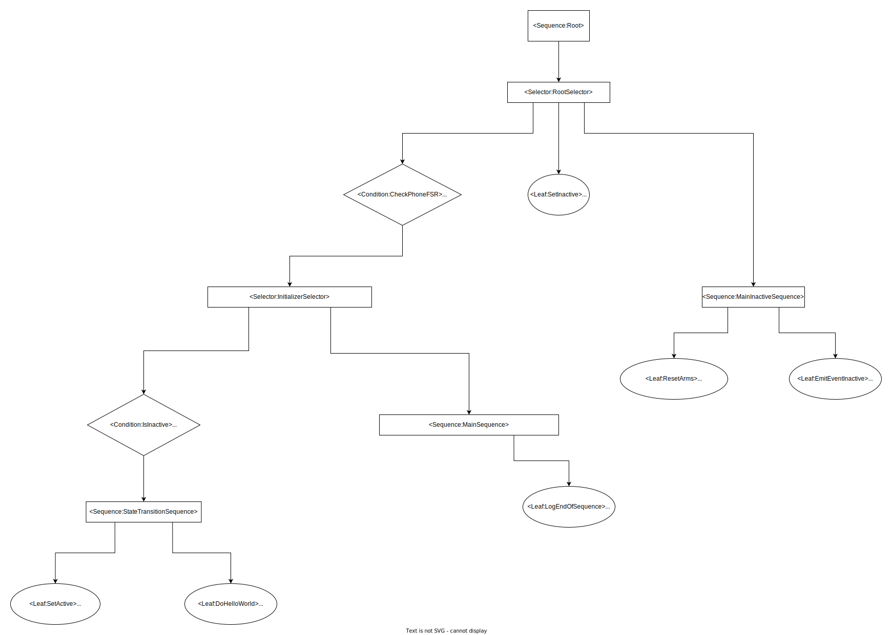
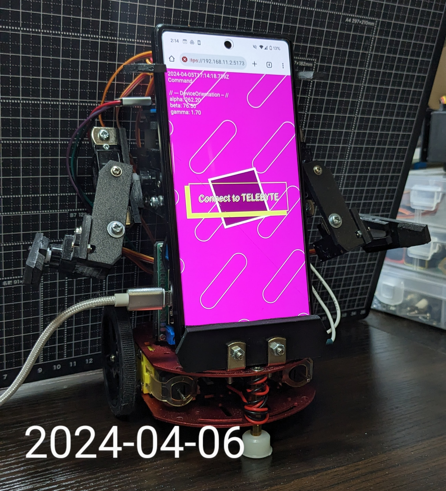

# Telebyte

Telebyte is a simple robot with a phone mount, which can be controlled via Web APIs (REST/WebSockets).
It also has it's own behavior/event handling system, implemented using a behavior tree.

this is a work in progress. I'm a beginner in anything of this sort so I'm expecting it will take some time until completion.

The robot is designed to be controlled through WebRTC (p2p, 1 to 1), forwarding commands from the opposite peer to Telebyte remotely.

## Control interface

### Web API endpoints

See [Documentation](docs/openapi.yaml)

### Websocket commands

_TODO_

## Behaviors

version 0.0.000001, nothing much yet

## Circuit Diagram

_TODO_

## Current state (2024/04/06)

Nothing much going on, but I'm planning to add more sensors soon.

The dc motors on the chassis will probably be replaced for ones with rotary encoders.

## Features I'm planning to implement

- Edge detection: since phone camera won't be able to tilt so you can't really see what's below the chassis

- Fall alert: (memo, would it be possible to build recovery systems?)

- Dance: just because

- Hot swappable? programmable? behavior: Technically, I could build a UI with draggable behavior nodes and before robot execution loop, just replace the new nodes with the old ones. UI will definitely be time-consuming to implement :S

## Contact

Shira - massivebugs@protonmail.com
